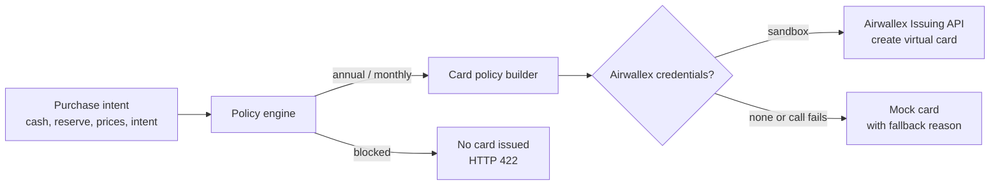

# Intent-Bound Purchase Agent

A treasury-aware purchasing agent for the **Airwallex Agentic Banking Hackathon** (Starter Kit 2: Intent-Bound Purchase Agent).

It decides whether a business should pay for SaaS **annually or monthly** without breaking its cash reserve policy. Then it issues an **Airwallex virtual card whose authorization controls encode that decision**, so the card can only make the purchase the agent approved.

> Annual plans are cheaper, but paying upfront can push a company below its reserve floor. The agent weighs savings against liquidity and the purchase's intent, explains every check it ran, and only issues a card for a plan that passes policy.

## How it works



1. **Evaluate.** The policy engine checks each plan against the reserve floor, compares 12-month cost, and applies the intent's risk rules. It returns a decision (`annual`, `monthly` or `blocked`), a plain-English reason, and a list of pass/fail policy checks.
2. **Approve.** The operator reviews the decision in the UI and clicks **Approve & issue card**. This is the human-in-the-loop step.
3. **Enforce.** The server re-runs the evaluation from the raw inputs (it never trusts a client-supplied decision) and turns it into Airwallex `authorization_controls`.

### Decision rules

| Rule | Detail |
| --- | --- |
| Reserve floor (hard) | Cash left after the upfront charge must stay at or above the required floor. For monthly billing, that is the first charge. |
| Cost | Annual price vs 12 × (monthly price + monthly overhead). |
| Commitment | Annual is chosen only when it passes the floor **and** its savings clear the intent's minimum. Otherwise the agent picks monthly if monthly passes. |
| Block | If neither plan keeps cash above the floor, the agent refuses and no card is issued. |

Purchase intent tunes how conservative the agent is:

| Intent | Required cash after purchase | Annual must save at least |
| --- | --- | --- |
| Strategic: core tool, proven need | Reserve floor | Any amount |
| Urgent: needed now, fit unproven | Reserve floor | 20% |
| Non-critical: nice-to-have | Reserve floor + 25% | 10% |

### Card controls (the "intent binding")

| Decision | `allowed_transaction_count` | `transaction_limits` | Active window |
| --- | --- | --- | --- |
| Annual | `SINGLE` | Exact annual price, `ALL_TIME` | 30 days |
| Monthly | `MULTIPLE` | Monthly price `PER_TRANSACTION` and `MONTHLY`, 12 × price `ALL_TIME` | 12 months |

Both card types are restricted to software merchant category codes (`5734`, `5817`, `5818`, `7372`).

## Run it

Requires Node.js 20 or later.

```bash
npm install
npm start          # http://localhost:3000
npm test           # 26 tests: policy engine, Airwallex client, HTTP API
```

Without credentials the app runs in **mock mode**. It shows exactly the create-card request it would send to Airwallex and labels the card as mock.

### Demo scenarios

The UI has one-click presets:

| Scenario | Result |
| --- | --- |
| **Annual fits** ($60k cash, $20k floor) | Annual. Saves $6,800 (19.5%) and keeps $12,000 of headroom. |
| **Annual breaches reserve** ($45k cash) | Monthly. Paying $28k upfront would leave $17k, below the $20k floor. |
| **Nice-to-have, tight cash** ($24k cash, non-critical) | Blocked. Even the first monthly charge breaks the 25% cushion. |

Try switching **Annual fits** to *Urgent*: 19.5% savings is below the 20% bar, so the agent switches to monthly.

## Airwallex sandbox setup

```bash
cp .env.example .env
```

| Variable | Required | Purpose |
| --- | --- | --- |
| `AWX_CLIENT_ID`, `AWX_API_KEY` | Yes, for sandbox mode | Sandbox API credentials |
| `AWX_BASE_URL` | No | Defaults to `https://api.sandbox.airwallex.com/api/v1` |
| `AWX_CARDHOLDER_ID` | No | Reuse an existing cardholder. Otherwise one `DELEGATE` cardholder is created per server run. |
| `AWX_CARDHOLDER_EMAIL` | No | Email for the auto-created cardholder |
| `AWX_CARD_CREATED_BY` | No | `created_by` value on card requests (Airwallex expects a full legal name) |
| `PORT` | No | Defaults to `3000` |

Integration safeguards:

- **Sandbox only.** The client refuses any base URL that is not `*.sandbox.airwallex.com`.
- **Idempotency.** Every create-card call carries a fresh `request_id`.
- **Major units.** Amounts are sent in dollars, not cents.
- **Token caching.** The login token is reused until shortly before `expires_at`.
- **Transparent fallback.** If any sandbox call fails, the API returns a mock card with a `fallbackReason` that includes the Airwallex error, so the demo never silently pretends a real card was made.

The card program is set to `COMMERCIAL` / `CREDIT` / `GOOD_FUNDS_CREDIT`, following the Airwallex commercial cards guide. If your sandbox account uses a different program, change `CARD_PROGRAM` in [src/airwallex.js](src/airwallex.js).

## API

All endpoints take and return JSON. Amounts are in USD major units.

| Method | Path | Description |
| --- | --- | --- |
| `GET` | `/api/health` | Liveness and issuer mode (`sandbox` or `mock`) |
| `GET` | `/api/config` | Intent definitions and issuer mode for the UI |
| `POST` | `/api/recommendation` | Evaluate a purchase. `200` with the decision, `400` with field errors |
| `POST` | `/api/virtual-card` | Evaluate and issue a card. `201` with `{ evaluation, cardPolicy, card }`, `422` if blocked, `400` on invalid input |

Request body for both `POST` endpoints:

```json
{
  "vendor": "Acme Analytics",
  "availableCash": 60000,
  "reserveFloor": 20000,
  "annualCost": 28000,
  "monthlyCost": 2800,
  "monthlyOverhead": 100,
  "purchaseIntent": "strategic"
}
```

`vendor` and `monthlyOverhead` are optional. `purchaseIntent` is one of `strategic`, `urgent` or `noncritical`.

## Project structure

```
server.js                 Entry point: loads .env, wires the issuer, starts Express
src/policyEngine.js       Input validation, decision rules, card policy builder (pure functions)
src/airwallex.js          Airwallex Issuing client with sandbox guard and mock fallback
src/app.js                Express routes and JSON error handling
public/                   Single-page UI (no build step)
test/                     node:test suites
```

## Limitations and next steps

- Merchant category codes restrict the card to software merchants, not to one specific vendor. A production version would add merchant ID allow-lists or post-authorization checks.
- Decisions are not persisted. An audit log of evaluations and approvals would be the next step for finance teams.
- Single currency (USD) and a single reserve snapshot. The policy could pull live balances and cash-flow forecasts from Airwallex.
- Intent is chosen from a fixed list. An LLM could extract intent, vendor and pricing from a quote or chat request and pass them into the same deterministic policy engine.

## License

MIT
